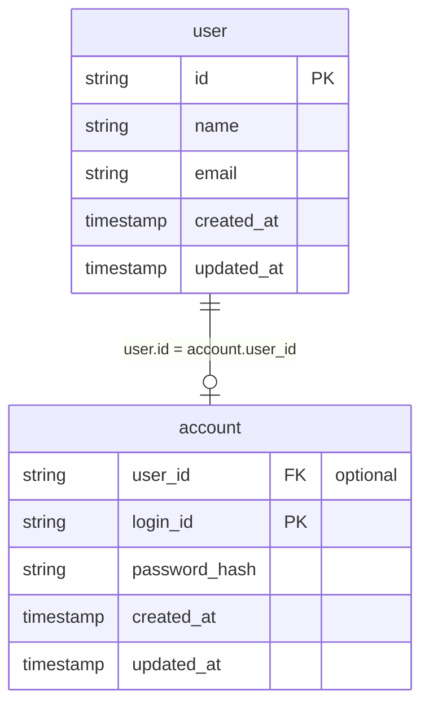

## ER Diagram

```mermaid
erDiagram
    user ||--o| account : "user.id = account.user_id"

    user {
        string id PK ""
        string name
        string email
        timestamp created_at
        timestamp updated_at
    }

    account {
        string user_id FK "optional"
        string login_id PK
        string password_hash
        timestamp created_at
        timestamp updated_at
    }
```
