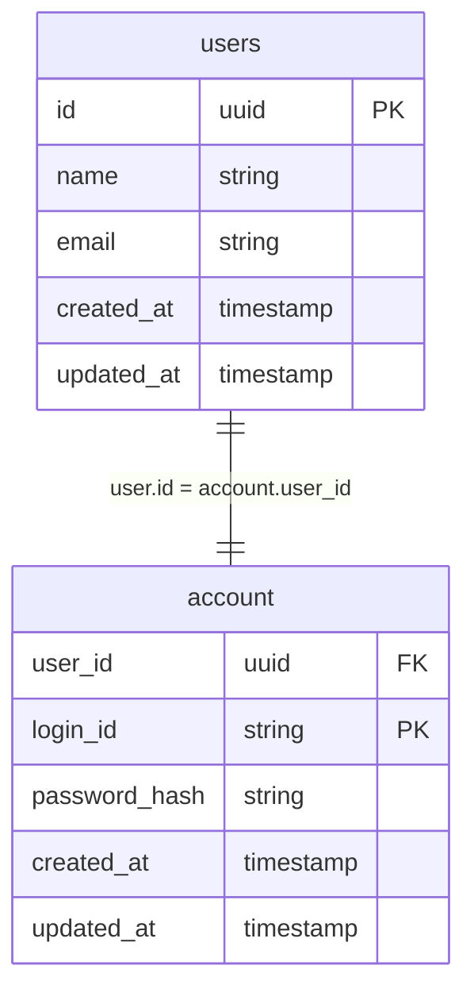

## ER Diagram

```mermaid
erDiagram
    users ||--|| account : "user.id = account.user_id"
    users {
        id uuid PK
        name string
        email string
        created_at timestamp
        updated_at timestamp
    }

    account {
        user_id uuid FK
        login_id string PK
        password_hash string
        created_at timestamp
        updated_at timestamp
    }
```
